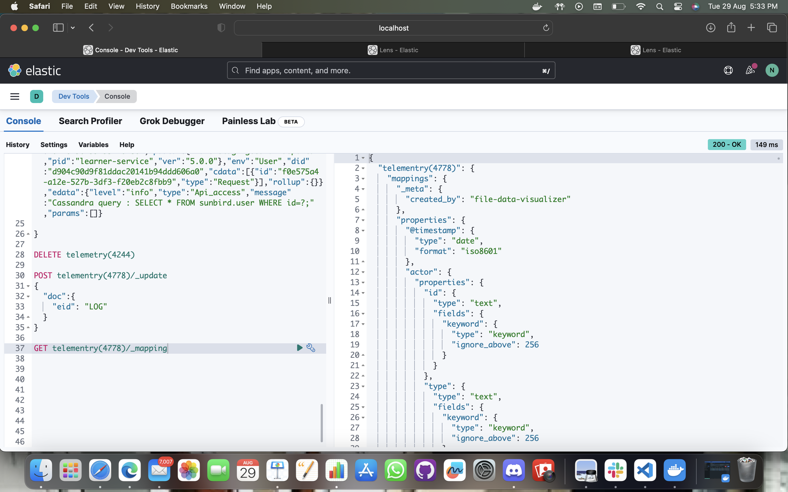

 <h1 align="center"> Elastic search Docuemtnation </h1>

<h2 align="left"> About Tech </h2>

- Elasticsearch :- Elasticsearch is a search engine (Port:9200) based on the Lucene library.
It provides a distributed, multitenant-capable full-text search engine with an HTTP web interface and schema-free JSON documents. 
We are using it under Sunbird obsrv to view data and retrieve data in much more effective and systemaic way , also it will provide us insight about various trend being followed in data.

- Kibana :- Kibana provides visualization capabilities on top of the content indexed on an Elasticsearch cluster. 
Users can create bar, line and scatter plots or pie charts and maps on top of large volumes of data. 
It show a interactive interface that can be accessed on the web 
(Port:5601)

<h2 align="left"> Dependencies required </h2>

[x] elasticsearch on local machine , for mac upgrade software to ventura first and it can be even downloaded as archive refer to links below 
- https://www.elastic.co/guide/en/elasticsearch/reference/current/install-elasticsearch.html
- https://www.elastic.co/guide/en/elasticsearch/reference/current/run-elasticsearch-locally.html 
[x] Setup it including seting up of global varianble and path. You will receive an id password along with ,
Authentication token at the time of running the elastic for the first time to link it to your kibana cluster keep it saved as it will be required everytime you log in.
[x] After succesful installation view port 9200 to see if its working , (http://localhost:9200)
 

<h3 align="left"> Steps to work </h3>

- To start elastic and kibana , open docker image and run them. Allow them to run for afew seconds then navigate to port:5601. Enter the user (elastic) and pssword that u saved earlier. 

- Navigate to hamburger icon on left of screen and go to development tools 
- All the query of Elastic are written in Json. 
+
[Management,Dev_tool]
----
➜ GET _cat/indices

- _cat is a command that offers a very readable output, it is most commonly used to interact with linux environment. To excecute a query in elastic click on play icon where you wrote the inital command as shown . 

- The output defines the running status of all the indices present , indices staus is defined by color as green , yellow and red. if its written open it means it is using resources of system.

- Earlier Elasticsearch used to support multiple type but now it only support doc, To create or delete a index we can follow the steps below.

+
[Management,Dev_tool]
----
➜ POST telementry(4244)/_doc/1
{
"Enter Your Data"
 }

- Here in above query 'telementry(4244)' is name of index (can be changed) , '_doc' is type (cannot be changed), '1' is unique indentifier.From the next line  enter the data of the index. 

- To view the the data of the index you have in ur elasticserver ,run below command 
+
[Management,Dev_tool]
----
➜ GET telemetry(4244)/_search

- Here in above query 'telementry(4244)' is name of index , '_search' is used to fetch data and tell status here.
By default it shows only 10 entries of data per hit 

- To overwrite the data in the the index we can keep the  unique indentifier used in above command same and enter the new value 

+
[Management,Dev_tool]
----
➜ POST telementry(4244)/_doc/1
{
"Enter New/Updated Data"
}

- To update the data in the the index we can keep the  unique indentifier used in above command 
same and use _update with it specifying the field to be updated

+
[Management,Dev_tool]
----
➜ POST telementry(4244)/_update/1
{
    "doc":{
        "eid" : "LOG"
    }

}

- In case we want to delete an index u have created 
+
[Management,Dev_tool]
----
➜ DELTE telementry(4244)/_doc/1

- The index gets deleted can you can make index with same name again.

- In case we want to view the schema/mapping created by elasticsearch 
for data we enetered. 
+
[Management,Dev_tool]
----
➜ GET telementry(4778)/_mapping

- The output show up mapping that was created by elasticsearch itself for the data

- In case we want to write the schema/mapping for data we enetered. 
Here i created a new empty index , using 
PUT tutorial2

+
[Management,Dev_tool]
----
➜ POST tutorial2/_mapping 

- The output show up mapping that was updated  for the data

- At last we can go to visualise select the type of visualisation we want and on what 
parameter we want to make a slice(Pie chart)

