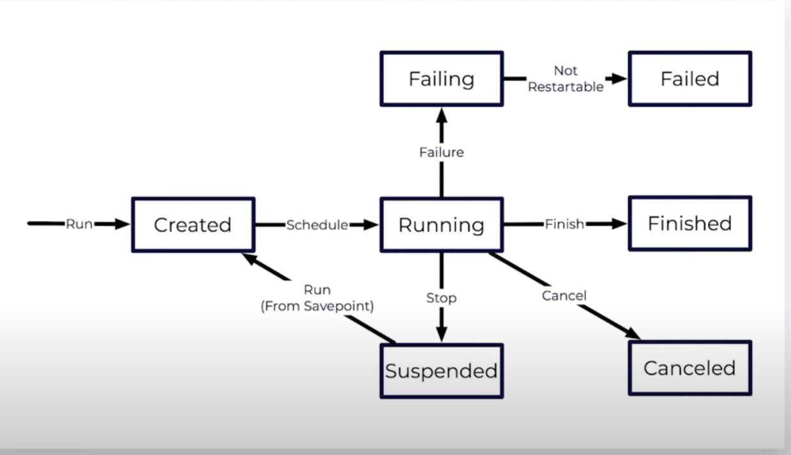

<h1 align="center"> Flink Docuemtnation </h1>

<h2 align="left"> About Tech </h2>

- Apache Flink is an open-source stream processing framework for big data processing and analytics.
It provides a fast, reliable, and scalable way to process real-time data streams and batch data 
with high throughput and low latency.

<h2 align="left"> Capabilities </h2>
Here's a brief overview of Apache Flink:

- Batch Processing

- State Management

- Event Time Processing

- Connectivity (Flink integrates well with various data sources and sinks, including Kafka, 
HDFS, Amazon S3, Elasticsearch, and more.)

- Fault Tolerance (Flink is designed for fault tolerance, ensuring that data processing continues seamlessly even in the face of node failures.)

- High Performance:

<h2 align="left"> Setting up Apache Flink </h2>

Setting up Apache Flink involves the following steps:

- Download: Download the Flink distribution from the official Apache Flink website.

- Configuration: Customize Flink's configuration files according to your cluster setup,
 memory requirements, and other parameters.

- Start Cluster: Start the Flink cluster using the provided scripts.
A Flink cluster consists of a JobManager and one or more TaskManagers.

- Submit Applications: Use the Flink command-line tools or APIs to submit your data processing 
applications to the cluster for execution.

Note:- 
- By default, the Flink JobManager's web interface runs on port 8081.
This interface provides insights into the running jobs, metrics, and other cluster details.