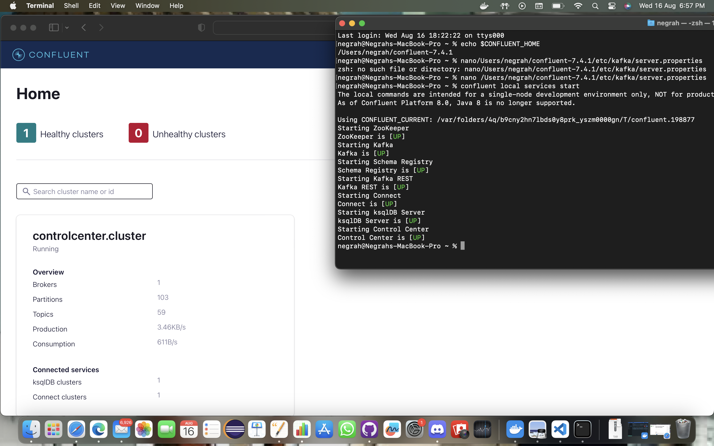
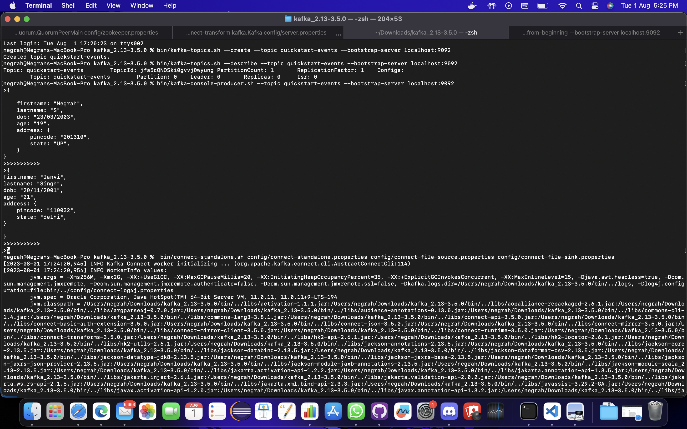
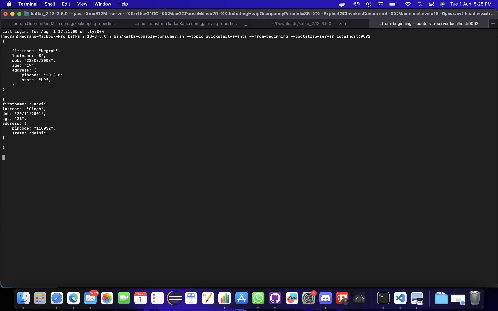

<h1 align="center"> Apache Kafka working </h1>

<h2 align="left"> Reason to use confluent over Apache  </h2>

- Full scale event streaming build on Apache kafka with additional features.
- It expands the benefit of kafka with  interprise-grade feautre with removing the burden of 
management or monitoring .
- Lets you focus on business value than underlying mechanics

<h2 align="left"> Dependencies required </h2>

[x] Confluent kafka , you can refer link below 
 https://www.confluent.io/get-started/?utm_medium=sem&utm_source=google&utm_campaign=ch.sem_br.brand_tp.prs_tgt.confluent-brand_mt.xct_rgn.india_lng.eng_dv.all_con.confluent-download&utm_term=confluent%20kafka%20download&creative=&device=c&placement=&gad=1&gclid=CjwKCAjwrranBhAEEiwAzbhNtdzXXtdQYNh8z_zRP8vimmMIhj6YuO0f-7NyZrTbfTrf9dW1ndeKRxoCvDwQAvD_BwE
[x] Setup it including seting up of global varianble and path . 

<h3 align="left"> Steps to work </h3>

- To start kafka and other required dependencies 
+
[source,bash]
----
➜ confluent local services start

- In the above image we can see all dependencies getting loaded and running while while it wworks on localhost:9092

- Kafka Producer code (In below exam "test-topic" is created kafka topic)
+
[source,bash]
----
➜ kafka-console-producer --topic test-topic --broker-list localhost:9092

- In above image we can see entering data when we run the above command. entered two Json file with similar type.

- Kafka Consumer code (In below exam "test-topic" is created kafka topic)
+
[source,bash]
----
➜ kafka-console-consumer --topic test-topic --bootstrap-server localhost:9092 --from-beginning

- In above image we can see entered  data when we run the above command.
Both the Json data entered in producer can be seen there ,
it shows that code is working well and ingesting data properly.

